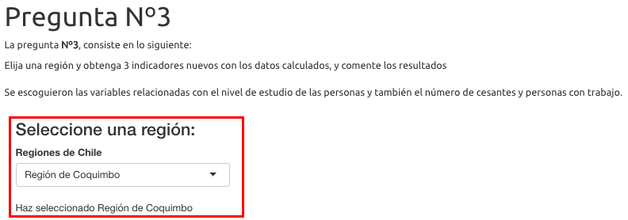

Como entender mi  trabajo *👋≧◉ᴥ◉≦* 

Lo primero es seleccionar un tab que esta asociado a cada pregunta del **TALLER**. Luego entontrará 03 ficheros con extensión **RMD**, estos archivos son los que contienen el código markdown para preparar el reporte,
en un posterior archivo **html**.

<h3>Librerías utilizadas</h3>
\
Descatamos las siguientes:

1. library(readr)
2. library(readxl)
3. library(tidyverse)
4. library(knitr)
5. library(rmdformats)
6. library(kableExtra)
7. library(DT)

<h3>Reporte Interecativo pregunta 3</h3>
\
Se intento usar la librería **shiny**, lamentablemente no logré que al momento de seleccionar una región actualizará el **DT** y los **comentarios**.Lo que se puso realizar es cambiar el valor de la variable que esta en la linea **31**
*region=1*.
\
<h3>Así se veía</h3>
\
